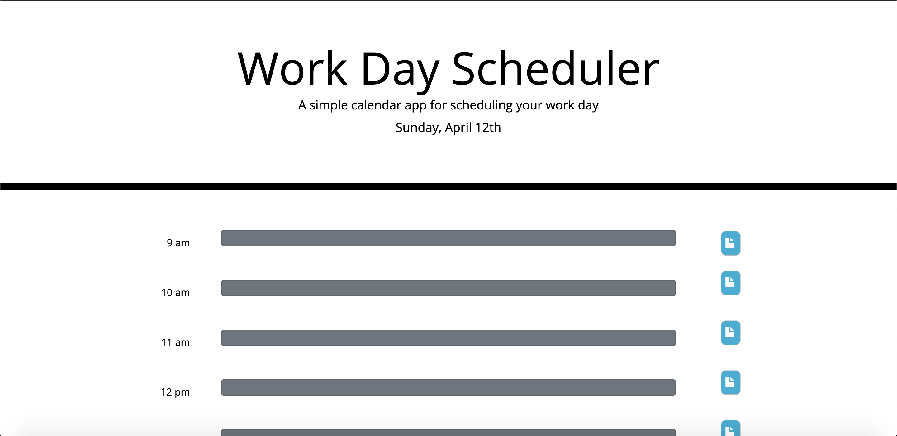

# Project Description
This project builds a website that serves as a planner so that people can write what they plan on doing every hour of the day. Hours that have passed are in grey, current hour is in blue, future hours are green. There is a save button so that data stays on the page even after refreshing. The project uses BootStrap to set the looks of the webpage, JQuery along with javascript, Moment.js to print the day, and local storage to save the contents on the page. 

# What the Website Looks Like
This is what the website looks like. 

# Link to Deployed Application
Link: https://anishasnet.github.io/work-day-planner/